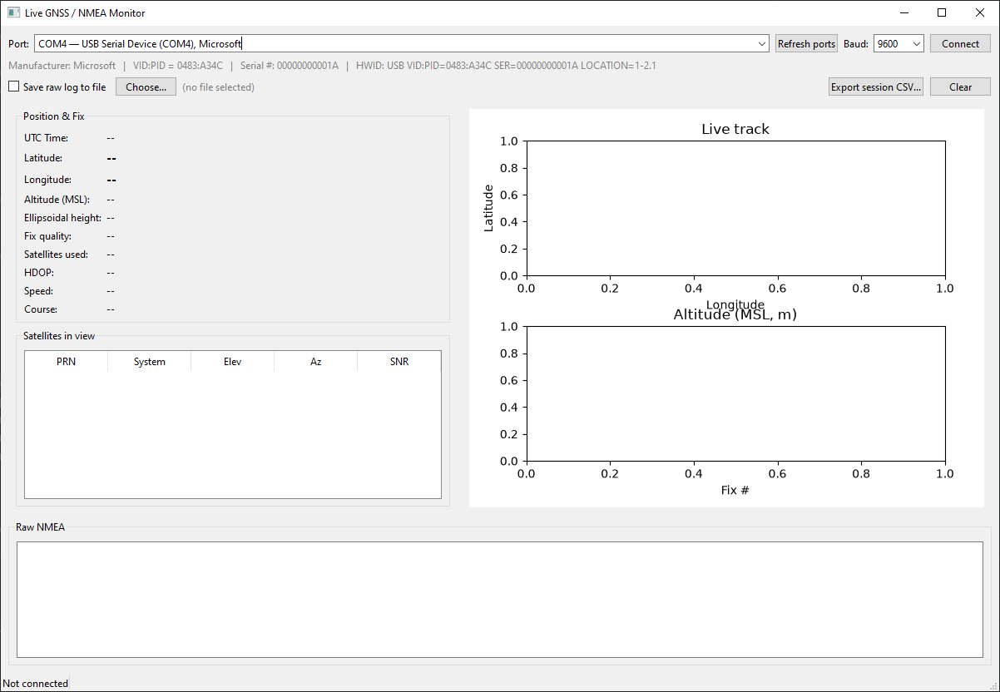

# nmea_gui
Real-time GUI for monitoring a GNSS receiver on a serial/COM port
(e.g. COM4 on Windows, /dev/ttyUSB0 on Linux/macOS).

Reads NMEA 0183 sentences (GGA, RMC, GSA, GSV, GLL, VTG) from the port in
a background thread and displays live-updating:
  - Position / fix quality / HDOP / satellite count / speed
  - A per-satellite signal-strength (SNR) table
  - A live track plot and altitude trace
  - A scrolling raw NMEA console

Requirements:
  PyQt6 pyserial matplotlib

Usage examples:

    uv run nmea_gui.py
    uv run nmea_gui.py --port COM4 --baud 9600 --autoconnect
    uv run nmea_gui.py --port /dev/cu.usbmodem00000000001A1 --autoconnect 

    python3 nmea_gui.py
    python3 nmea_gui.py --port COM4 --baud 9600 --autoconnect

Only tested with QRP-Labs QLG2 GPS Receiver kit on Windows 10, with python 3.13 and on Mac OS 26.5 with python 3.14.
Note that on a Mac you should not connect via an USB-hub. Using a USB-hub might leave the QLG2 in DFU boot loader.

